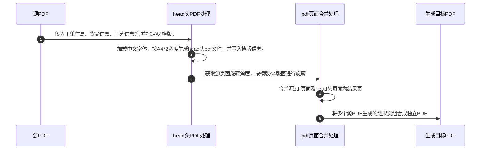

# pdf 处理
> 按单按行处理多个pdf(添加订单货品的head头区域)，并支持将处理完的多个pdf合并成一个pdf，提供打印预览服务

第三方库对比: https://dothinking.github.io/2021-01-02-Python%E5%A4%84%E7%90%86PDF%E7%9A%84%E7%AC%AC%E4%B8%89%E6%96%B9%E5%BA%93%E5%AF%B9%E6%AF%94/

流程图: 

样例:

* pip3 config set global.index-url https://mirror.baidu.com/pypi/simple/
* pip install PyMuPDF
* pip install fonttools
* ~~pip install pymupdf-fonts~~
* pip install qrcode
* pip install fastapi[all]
* pip install uvicorn[standard]
* pip install tqdm

可选支持参考:
https://pymupdf.readthedocs.io/en/latest/installation.html#notes

test file:
* https://file.yj2025.com/CH3600-1-M04003A%20%E6%90%AC%E8%BF%90%E7%88%AA%E5%AE%89%E8%A3%85%E6%9D%BF-%E9%95%BF.pdf
* https://file.yj2025.com/003.pdf
* https://file.yj2025.com/WX20230909-172402%402x.png
* https://file.yj2025.com/%E5%B7%A5%E7%A8%8B%E5%9B%BE%E7%BA%B80940-%E7%AB%96%E5%90%91.pdf
* https://file.yj2025.com/PD5060-GL-016T%20%E9%95%9C%E6%9E%B6%E6%8A%A4%E7%BD%A9.pdf
* https://file.yj2025.com/CS01-P3-001.pdf
* https://file.yj2025.com/CS01-P3-002.pdf
* https://file.yj2025.com/CS01-P3-003.pdf
