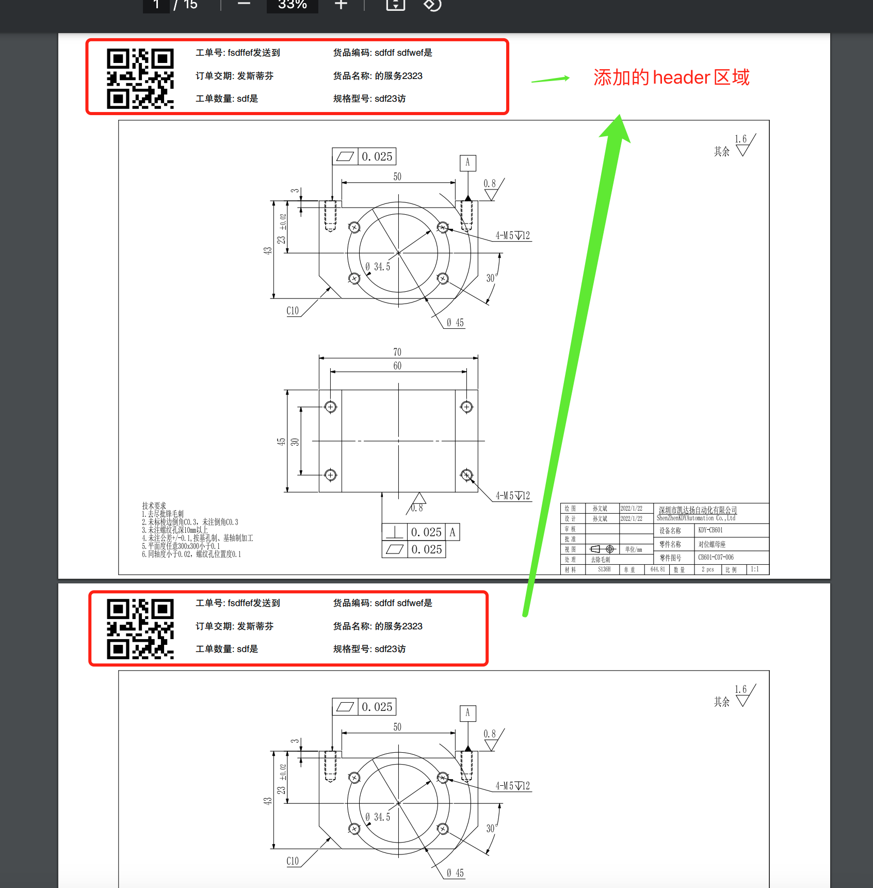

# pdf 处理
> 第三方库对比: https://dothinking.github.io/2021-01-02-Python%E5%A4%84%E7%90%86PDF%E7%9A%84%E7%AC%AC%E4%B8%89%E6%96%B9%E5%BA%93%E5%AF%B9%E6%AF%94/

样例:

* pip3 config set global.index-url https://mirror.baidu.com/pypi/simple/
* pip install PyMuPDF
* pip install qrcode
* pip install fastapi[all]
* pip install uvicorn[standard]