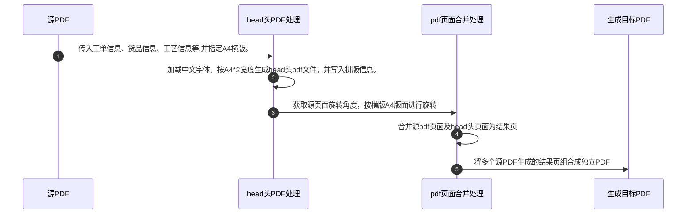
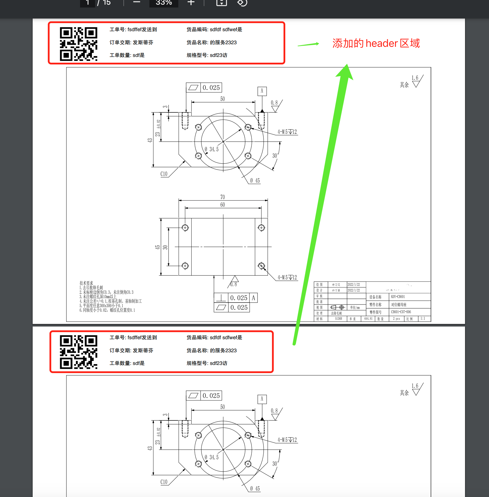

# pdf 处理
> 按单按行处理多个pdf(添加订单货品的head头区域)，并支持将处理完的多个pdf合并成一个pdf，提供打印预览服务

第三方库对比: https://dothinking.github.io/2021-01-02-Python%E5%A4%84%E7%90%86PDF%E7%9A%84%E7%AC%AC%E4%B8%89%E6%96%B9%E5%BA%93%E5%AF%B9%E6%AF%94/

1. 初始化 python 虚拟环境: `python3 -m venv pdf-processor/venv`
2. 并切换到当前环境 `cd pdf-processor && source ./venv/bin/activate`, windows 下自行google。
3. 安装依赖 `pip install -r requirements.txt`
4. 启动应用: `uvicorn main:app --host 0.0.0.0 --timeout-keep-alive 60 --workers 8`

依赖管理:
```
# 安装依赖
pip install -r requirements.txt
# 生成依赖描述文件
pip freeze > requirements.txt
```


流程图: 



样例:


* pip3 config set global.index-url https://mirror.baidu.com/pypi/simple/
* pip install PyMuPDF==1.24.5
* pip install fonttools
* ~~pip install pymupdf-fonts~~
* pip install qrcode
* pip install fastapi[all]
* pip install uvicorn[standard]
* pip install tqdm
* pip install Pillow
* ~~pip install matplotlib~~
* pip install qiniu
* pip install prettytable
* pip install apscheduler
* pip install scalar-fastapi

压力测试工具:
* pip install locust

pymupdf介绍:
https://artifex.com/blog/text-extraction-with-pymupdf

有用的方法:
```
page.get_text("dict", sort=True)
```

dom树:
https://pymupdf.readthedocs.io/en/latest/_images/img-textpage.png

可选支持参考:
https://pymupdf.readthedocs.io/en/latest/installation.html#notes

如何标记非水平文本
https://pymupdf.readthedocs.io/en/latest/recipes-text.html#how-to-mark-non-horizontal-text

分析字体特征
https://pymupdf.readthedocs.io/en/latest/recipes-text.html#how-to-analyze-font-characteristics

字体处理:
https://pymupdf.readthedocs.io/en/latest/recipes-text.html#how-to-fill-a-text-box

test file:
* https://file.yj2025.com/CH3600-1-M04003A%20%E6%90%AC%E8%BF%90%E7%88%AA%E5%AE%89%E8%A3%85%E6%9D%BF-%E9%95%BF.pdf
* https://file.yj2025.com/003.pdf
* https://file.yj2025.com/WX20230909-172402%402x.png
* https://file.yj2025.com/PD5060-GL-016T%20%E9%95%9C%E6%9E%B6%E6%8A%A4%E7%BD%A9.pdf
* https://file.yj2025.com/CS01-P3-001.pdf
* https://file.yj2025.com/CS01-P3-002.pdf
* mark区域坐标不对: https://file.yj2025.com/CS01-P3-003.pdf
* 带管子图: https://tfile.yj2025.com/pdf-processor/source/2024-03-26/28205N61101AAA.pdf
* 箭头注释: https://tfile.yj2025.com/pdf-processor/source/2024-04-07/7003361(1).pdf
* 文字注释: https://tfile.yj2025.com/pdf-processor/source/2024-04-07/mt_04_24024_0_812--1.pdf
* https://tfile.yj2025.com/pdf-processor/source/2024-04-08/竖向图纸.pdf
* https://tfile.yj2025.com/pdf-processor/source/2024-04-08/竖向图纸2.pdf
* https://tfile.yj2025.com/pdf-processor/source/2024-04-08/CS01-P3-001-竖向-右侧.pdf
* https://tfile.yj2025.com/pdf-processor/source/2024-04-08/工程图纸0940-竖向.pdf
* https://tfile.yj2025.com/pdf-processor/source/2024-04-08/横向图纸.pdf
* 遮罩位置不对 https://tfile.yj2025.com/pdf-processor/source/2024-04-09/竖图-0度-左侧为底.pdf
* 无法矫正, 无法获取文字信息 https://tfile.yj2025.com/pdf-processor/source/2024-04-08/竖图方向不正确-1.pdf
* https://tfile.yj2025.com/pdf-processor/source/2024-04-08/用wps设置方向后，与视图方向翻转180.pdf
* https://tfile.yj2025.com/pdf-processor/source/2024-04-08/打开方向正确-打印翻转了180°-20231205-明信达.pdf
* https://tfile.yj2025.com/pdf-processor/source/2024-04-08/打开方向正确-打印翻转了180°-20231023-雄利.pdf
* https://tfile.yj2025.com/pdf-processor/source/2024-04-08/文件倒转了-401-990022-00.pdf
* 48序号显示不全 https://tfile.yj2025.com/pdf-processor/source/2024-04-11/240406-01-230-106.pdf
* https://tfile.yj2025.com/pdf-processor/source/2024-04-15/竖图-翻转方向正确的.pdf
* 未clean则丢失内容,并且重影: https://tfile.yj2025.com/pdf-processor/source/2024-03-26/mt_03_22318er_0_806.pdf
* clean后丢失内容: https://tfile.yj2025.com/pdf-processor/source/2024-04-08/内容丢失-401-020605-00.pdf
* 未clean 丢失注释, wrap后批注位置不对 https://tfile.yj2025.com/pdf-processor/source/2024-04-16/mt_04_23024cc_0_806.pdf
* wrap后批注位置不对 https://tfile.yj2025.com/pdf-processor/source/2024-04-16/mt_04_229856vx_0_806.pdf
* 虚线位置不对 https://tfile.yj2025.com/pdf-processor/source/2024-05-04/NOR4.002.004（V02）.pdf